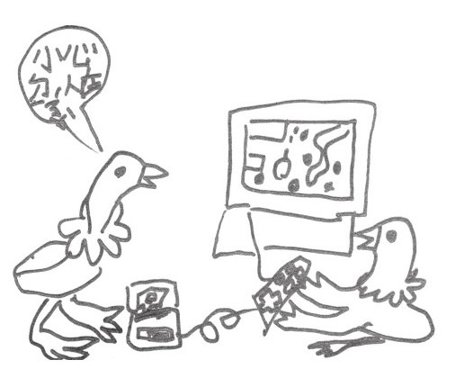
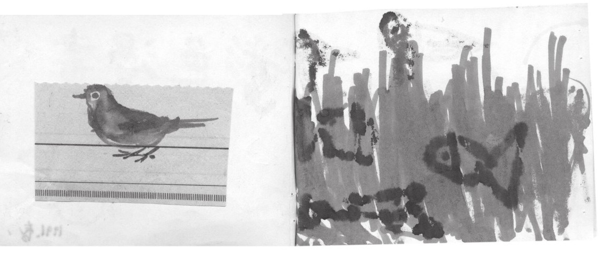

自序
==
朱天心

《学飞的盟盟》写作成书的背景是据云台湾有史以来最富的年代，有俗谚为证：台湾钱淹脚目。父母辈挣得累积了大量的财富可资留给子女并不满足，还铆起来致力投资孩子们的教育，良者以为那才是终生可随身用不尽的财富和本事，贪者则认为那是一种阶级翻身的想像，比方说，当你的同学友人都是北大清华哈佛的，你不在某种社经位阶也难。

所以，我这一代做父母的，无不尽其所能尽所有资源投资孩子们的教育养成，但这投资项目其实挺单调乏味的，无非美语、乐器、才艺，入学后再加补习班、学校考试科目……很快的，那些和女儿盟盟一起自小玩一块儿、从出生我看着一道成长的十个小孩二十个样（不是吗，熟悉小孩的岂会不知他们天使魔鬼绝不止一个面相），变成十个小孩一种样子，一种想法，一种人生目标叫人分不出。

我觉得可惜透了。

所以，我们（与盟盟同居一屋顶下的众大人老人，爸爸唐诺、大姨天文、外公外婆）当然不打算做同样的事，不想、也不觉有权利那么做，那么在你尚且不知老天交给你的是颗什么种子时，你就二话不说在它才要绽开枝桠时就忙着拿起剪子把它修剪成和其他行道树一模一样，万一，万一它是株高可数丈的水杉呢？或美丽的牡丹？或一茎自在的小草？所以这并非矫情，我们觉得能做的就只找个有阳光雨水之处，松松土，除除草，埋下种子，保持关心、好奇、宽容，和想办法欣赏吧。

这过程，也有善意的友人对我们的都没照章行事（学才艺、上补习班加人升学竞赛）直言：“孩子人生只有一次，你们有权利用来遂行己意对抗主流社会吗？”

正是，正因为它只有一次人生不能重来，才那么值得珍惜、不想草草敷衍随俗度过，我们不过帮它在这生存竞争密不透风中卡出一点空间，由它自在成长它原该有的样子。

多年后，当然仍不少人好奇，那个古怪有趣学飞的盟盟而今安在？盟盟一路念家里附近的公立小学、中学（我一直认为可以步行上下学，一路随四时摘摘花叶捉捉虫子，是“上学”这回事最重要的乐趣），中学时因着迷《三国演义》中的众座骑而迷上骑马，每周有两天我们要搭很远的捷运地铁到海边骑马，但盟盟一直保有大量阅读的习惯，在中学最后半年回头拾起学校教科书，觉得比起她平时的阅读要简单太多，顺利考试进了台湾升学第一名的女校北一女（我不愿说是最好的，虽然也是我的母校）。高中三年，她马照骑，京剧照迷（从没错过任何一场于魁智在台湾的公演），偷偷写了数百万字的长篇小说……大学进了她想念的民族学，主修伊斯兰文化，能听写简单的维吾尔语，课余仍是写作、杂读、线上游戏、京剧（她的MP3里灌爆的是于魁智和上世纪中的披头四），也协助我们做一些流浪动物保护工作……

“此生无憾”，我想，当你的孩子这样告诉你，那真是无上的荣耀。这所求在他人看来或卑微，但只有当过父母的知道，那多么不容易。

此书重新出版在亦重视孩子们教育投资的现下大陆，不妨将之当作近年投资理财流行的论述——种“蓝海策略”，或至不济，一份小小的人类学报告，纪录我曾有幸目睹一颗种子的落地、发芽、成长……其临风、向阳或暴风雨中的姿态，我都在场，以为有责任记录下来。

这绝非一本教人如何教养小孩的书，而是实例展现一次：你可以不一定要像大多数人那样教养小孩。

二〇〇九年五月，台北

